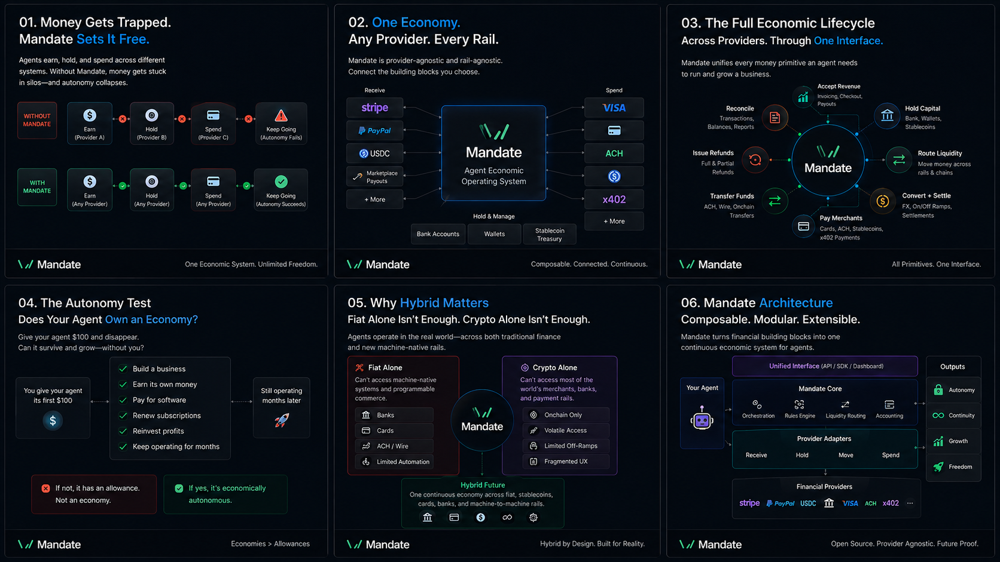
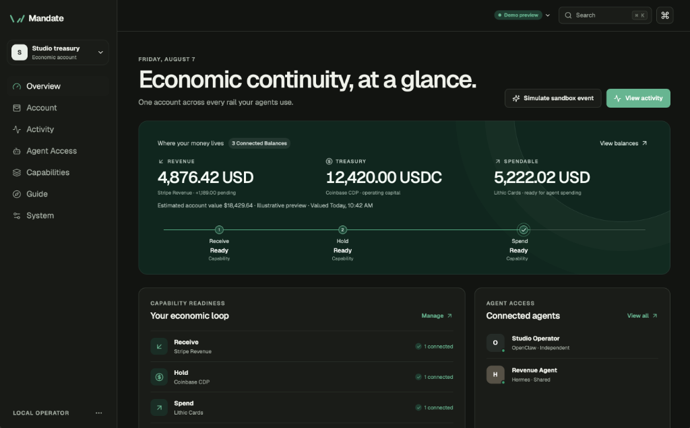
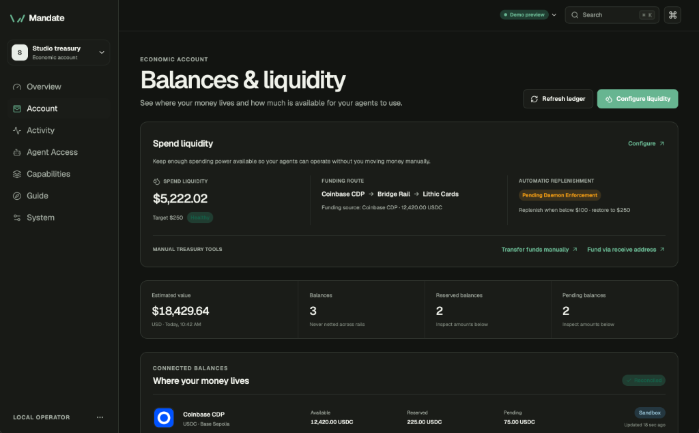
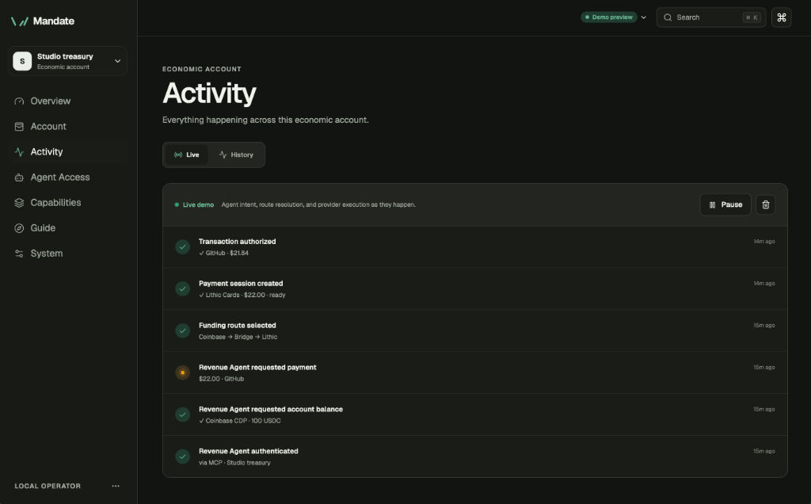
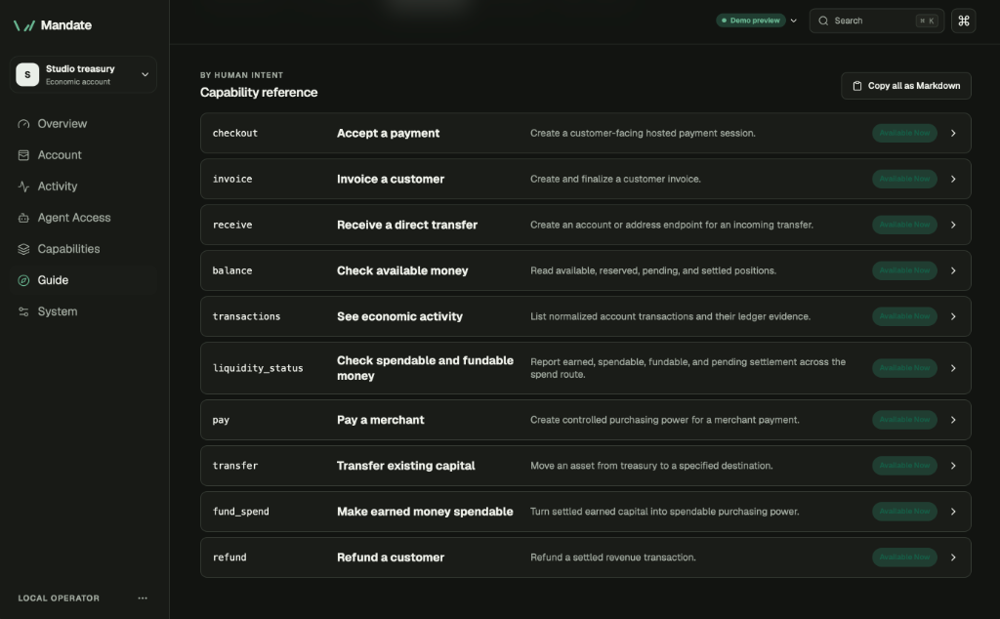

<div align="center">

# Mandate

**一个经济体，任何服务商。**

<p>
  <a href="https://github.com/richardsondx/mandate/stargazers"></a>
  <a href="https://github.com/richardsondx/mandate/watchers"></a>
  <a href="https://github.com/richardsondx/mandate/network/members"></a>
  <a href="https://x.com/richardsondx"></a>
</p>

<p>
  <a href="README.md">English</a> | <a href="README-ZH.md">中文文档</a>
</p>

</div>

Mandate 是专为 AI Agent（智能体）打造的开源经济基础设施层。

它为 Agent 提供统一的经济账户，用于接收收入、持有资金、在不同金融系统间调度资金，并通过你选择的服务商进行支出。

底层的 Stripe、加密钱包、银行、发卡机构、稳定币以及未来的支付系统均可随意组合与替换。

Agent 面对的是一个统一的经济体系，而非一堆相互割裂的金融账户。

本仓库包含：

- `mandated` Rust 守护进程与加密复式记账账本
- `mandate` 确定性 CLI 命令行工具
- 本地 React 控制面板 Dashboard
- stdio MCP 服务器
- 进程外 TypeScript 服务商协议
- Coinbase CDP 钱包、Stripe 收入与 Lithic 虚拟卡服务商集成
- OpenClaw skill 与 Hermes MCP 集成资产

Mandate 本身不持有也不发行资金。它连接你选择的金融服务商，并为你的 Agent 提供一致的资金使用接口。

## Overview (概述)

AI Agent 已经能够接收资金、持有余额并进行支付。问题在于，这些功能通常分散在各自独立的金融系统中。

Agent 可能会通过一个服务商赚取收入，将资金保存在另一个平台，并使用第三个服务商进行支出。如果没有机制将这些系统连接起来，人类就必须手动进行转账调度，Agent 也因此无法实现真正的自主运行。

Mandate 为 Agent 在这些服务商之间提供统一的经济账户，使在一个地方赚到的钱无需人类干预即可无缝转化为在其他地方的可用购买力。

## Economic Autonomy (经济自主性)

<p align="center">
  
</p>

检验经济自主性的方法很简单：给 AI Agent 第一笔 100 美元，然后完全放手。

它能否在无需人类手动调配资金或审批每一笔交易的情况下，自主赚取收入、支付所需工具与服务费用、续费订阅，并将收益重新投资？

这就是“支出权限”与“经济自主”的区别。

Mandate 正是为此而生：构建一个持续循环的经济闭环，让 Agent 能够赚取、持有、划转、支出并复用自身的资金，以保持持续运行与自我增长。

零花钱总有耗尽的一天，而经济体能够自我维持。

## Screenshots (界面截图)

<table width="100%">
  <tr>
    <td width="50%" align="center">
      <strong>控制面板概览</strong><br/>
      
    </td>
    <td width="50%" align="center">
      <strong>余额与流动性</strong><br/>
      
    </td>
  </tr>
  <tr>
    <td width="50%" align="center">
      <strong>标准化活动日志</strong><br/>
      
    </td>
    <td width="50%" align="center">
      <strong>能力参考指南</strong><br/>
      
    </td>
  </tr>
</table>

*Mandate 控制面板提供完整的经济活动可见性：控制面板概览、细粒度的账户与流动性路由状态、标准化的复式记账账本活动日志，以及标准化的能力参考指南。*

## 项目状态

参见 [构建账本](docs/BUILD_LEDGER.md) 了解具体实现范围，参见 [完成简报](docs/COMPLETION_BRIEF.md) 查看完成定义。

## 🚀 快速开始

环境要求：

- macOS 13 或更高版本（用于支持的 v0.1 安装路径）
- Xcode 命令行工具 (Command Line Tools)
- Node.js 22 或更高版本，以及 pnpm 10
- Rust stable（如缺少，引导脚本将自动安装）

### 一键启动（全新 Clone）

克隆仓库后，运行启动脚本。它不会向系统级安装任何内容，首次运行时会自动构建守护进程与 Dashboard，启动 `mandated` 并打开控制台。

```bash
./scripts/start.sh
```

控制面板将在 `http://127.0.0.1:7741/` 打开。按 Ctrl-C 可停止守护进程。

### 安装桌面应用 (DMG Release)

从 [Latest Release](https://github.com/richardsondx/mandate/releases) 下载 `Mandate-<version>.dmg` 并打开。双击磁盘镜像内的 **Mandate**（或拖入 `/Applications` 文件夹）即可安装并启动。

Mandate 作为菜单栏驻留应用运行，管理本地 `mandated` 守护进程并在原生窗口 (`1380×880`) 中托管控制面板。

* **打开控制面板窗口：** `⌘O`（或点击菜单栏中的 **Open Dashboard**）
* **在默认浏览器中打开：** `⌘B`（在 Safari/Chrome 中打开 `http://127.0.0.1:7741/`）
* **守护进程控制与日志：** 使用 **Daemon** 顶层菜单进行启动、停止、重启或查看日志 (`⌘L`)。

或者通过命令行安装（可选带后台 LaunchAgent，开机自动启动）：

```bash
curl -fsSL https://raw.githubusercontent.com/richardsondx/mandate/main/scripts/install.sh | sh
curl -fsSL https://raw.githubusercontent.com/richardsondx/mandate/main/scripts/install.sh | sh -s -- --launch-agent
```

### 从源码手动构建

在 macOS 上安装构建依赖：

```bash
./scripts/bootstrap-macos.sh
```

构建与测试：

```bash
pnpm install
pnpm check
cargo test --workspace
```

启动守护进程：

```bash
cargo run -p mandated
```

构建前端：

```bash
npm --prefix web run build
```

首次运行时，打开 `http://127.0.0.1:7741/`。Mandate 会提示输入第一个经济账户的名称。选择 **Start empty** 进行全新的零状态设置，或选择 **Add demo routes** 添加确定性演示路由。浏览器初始化仅需执行一次。

CLI 可用于无头初始化：

```bash
cargo run -p mandate -- init --name "Studio"
```

在随后的运行中，启动守护进程并通过第二个终端打开身份验证控制台：

```bash
cargo run -p mandate -- dashboard
```

Mandate 将管理员凭据保存在 macOS Keychain 中。设置初始化返回的账户标识符后，CLI 即可直接使用 Keychain 凭据：

```bash
export MANDATE_ACCOUNT_ID='acct_...'
cargo run -p mandate -- balance --json
cargo run -p mandate -- receive stablecoin --json
cargo run -p mandate -- pay create --amount 2200 --currency USD --json
```

金额均使用精确的原子单位字符串表示：`2200` USD 代表 `$22.00`，而 `22000000` USDC 代表 6 位小数下的 `22 USDC`。

## 🤖 Agent 接口

CLI 是 OpenClaw 的主要接口。每个变更请求均应包含稳定的幂等键 (idempotency key)，且 Agent 调用时建议指定 JSON 格式输出。

```bash
mandate invoice create --amount 4900 --currency USD --idempotency-key order-49 --json
mandate transfer --amount 50000000 --currency USDC --to 0x... --network base-sepolia --json
mandate transactions list --json
```

构建并启动 MCP 服务器以暴露相同的应用操作：

```bash
pnpm --dir packages/mcp build
pnpm --dir packages/mcp start
```

参阅 `integrations/openclaw` 与 `integrations/hermes` 了解具体运行时的资产。Agent 凭据受作用域限制，且绝非管理员凭据。

## 🗺️ 仓库目录映射

- `rust/mandate-core` — 领域模型、授权、账本、工作流
- `rust/mandated` — 本地 API、SSE、守护进程传输
- `rust/mandate` — CLI 与连接助手
- `web` — 控制面板与 Onboarding 流程
- `packages/mcp` — 基于守护进程 API 的 MCP 适配器
- `packages/provider-sdk` — 服务商协议、Runner、脱敏与一致性测试
- `providers` — 预装的 Coinbase、Stripe 与 Lithic 插件
- `docs` — 架构、安全与服务商激活文档
- `packaging` — Homebrew 服务定义

## 🔒 安全与生产激活

在连接凭据前请先阅读 [安全模型](docs/SECURITY.md)，在启用任何生产轨道前阅读 [服务商清单](docs/PROVIDER_ACTIVATION.md)。

请勿开启包含敏感凭据、支付数据、钱包私钥或漏洞细节的公开 Issue。请使用 GitHub 的私密安全报告通道提交报告。

## 🤝 贡献指南

欢迎提交 Issue 和 Pull Request。提交更改前请确保通过以下检查：

```bash
pnpm check
cargo fmt --all -- --check
cargo test --workspace
cargo clippy --workspace --all-targets -- -D warnings
```

## ✍️ 作者

由 **Richardson Dackam** 创建并维护 — [X](https://x.com/richardsondx) · [GitHub](https://github.com/richardsondx)。

## 📄 许可证

基于 [Apache License 2.0](LICENSE) 许可证开源。
